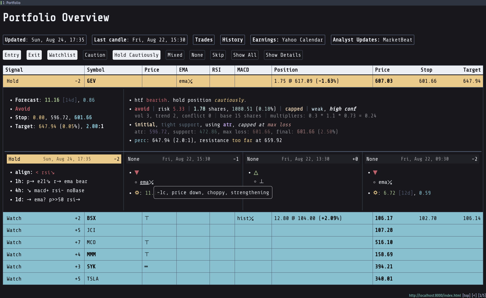

# FinTracker

FinTracker is a personal project for tracking and managing swing trades. It is built in
C++ and Python, and designed to run on a home server. It automates data collection,
signal generation, backtesting, position tracking, and alerting, with access and
control available via Telegram and HTML dashboards.



---

## Features

- **Live Data Collection**\
  Periodically fetches real-time stock data from the Twelve Data API.

- **Indicator Computation & Signal Generation**\
  Calculates technical indicators (e.g. EMA, RSI) and generates buy/sell signals.

- **Backtesting & Signal Weighting**\
  Evaluates signals using historical performance, computing win rates, average returns, and drawdowns.

- **Position & Risk Management**\
  Tracks open positions and stop-loss levels, updating in real-time.

- **HTML Dashboard**\
  Generates interactive HTML pages using Plotly, viewable from any browser. Output is saved in the `page/` directory (main file: `page/index.html`).

- **Telegram Bot Control**\
  Enables command-based interaction through a personal Telegram bot [@fintracker1\_bot](https://t.me/fintracker1_bot), including:

  - Adding or closing trades (/buy, /sell)
  - Viewing signal status, positions, recent trades, and earnings info
  - Generating charts

- **Trade Import**\
  Imports and processes raw trade data from Trading212 exports using `scripts/clean_trades.py`

---

## Personal Usage Notes

- This project is solely developed for personal use and tailored to my trading preferences.
- It is primarily designed for **long-only swing trading** with a typical **holding period of 2 to 10 days**.
- Many aspects are **hardcoded** and not intended for general-purpose use without modification.

---

## Repository Layout

```
fintracker/
├── CMakeLists.txt
├── data/
│   ├── index.css, trades.css, index.js, trades.js
│   ├── index.html, trades.html
│   ├── tickers.csv          # Tracked symbols
│   ├── positions.csv        # Trade history
│   └── trades_exported/     # Raw Trading212 exports
├── include/                 # Header files
├── scripts/                 # Python tools for plotting and processing
├── src/                     # C++ source files
├── page/                    # Generated HTML output
└── README.md
```

---

## Build Instructions

### Requirements

- CMake 3.15+
- A C++ compiler with C++20 or higher (note: `CMAKE_CXX_STANDARD` is currently set to `26`)
- Python 3.8+
- Python packages: `requests`, `pandas`, `plotly`, `python-telegram-bot`
- Required environment variables:
  - `TD_API_KEY_1`, `TD_API_KEY_2`, `TD_API_KEY_3`
  - `TG_TOKEN`, `TG_CHAT_ID`, `TG_USER`

### Build

```bash
git clone https://github.com/AnglyPascal/fintracker.git
cd fintracker
mkdir build && cd build
cmake ..
make
```

### Run

```bash
./fin [options]
```

---

## Command-Line Options

- `-d`, `--debug`: Enable debug output
- `-t`, `--disable-tg`: Disable Telegram bot updates
- `-r`, `--replay`: Enable replaying mode
- `-p`, `--disable-plot`: Disable plotting
- `-c`, `--continuous`: Enable continuous replaying

---

## Configuration

Configuration is primarily hardcoded. Some data is read from CSV files:

- `data/tickers.csv`: List of tracked symbols, e.g.:

  ```csv
  add,symbol,priority,sector
  +,AAPL,1,technology (consumer electronics)
  +,ABT,2,healthcare (medical devices & services)
  ```

- `data/positions.csv`: Trade history, e.g.:

  ```csv
  Time,Ticker,Action,Qty,Price,Total
  2025-06-26 12:28:36,AMD,BUY,1,100,100
  2025-06-26 12:41:35,TSLA,SELL,1,100,100
  ```

Use `scripts/clean_trades.py` to process Trading212 exports into a consolidated `positions.csv` file.

---

## Telegram Bot Commands

Interact with the system remotely via the Telegram bot [@fintracker1\_bot](https://t.me/fintracker1_bot):

- `/buy SYMBOL QTY PRICE` — Buy stock
- `/sell SYMBOL QTY PRICE` — Sell stock
- `/status SYMBOL` — Get indicator/signal status for a symbol
- `/positions` — List all open positions
- `/trades [SYMBOL] [SINCE]` — List trades (optionally filtered)
- `/plot SYMBOL` — Generate a Plotly chart

---

## Development Notes

- Builds a header (`include/_html_template.h`) from the HTML/JS/CSS files in `data/` using `scripts/embed_str.py`
- Environment variables must be exported manually before cmake configuration

---

## License

This project is released under the MIT License. See [LICENSE](LICENSE) for details.

